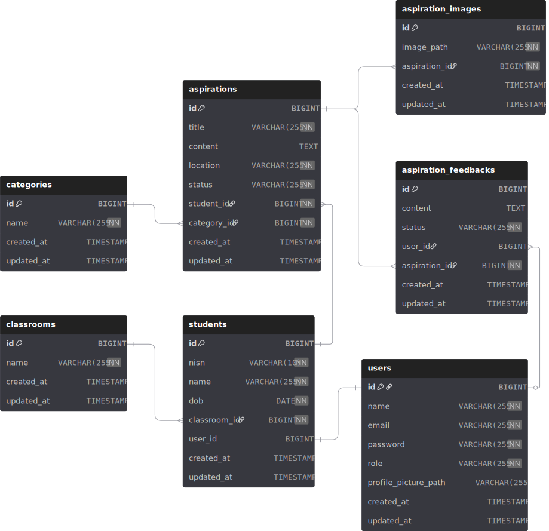

# PeSarana  

Platform pengaduan dan pelaporan sarana/prasarana sekolah berbasis website. Dibuat menggunakan framework Laravel 12 dan database PostgreSQL.  

## Database  

  

<h4 align="center">Gambar 1.1 ERD - PeSarana</h4>  

---

### Table Users  

- id (primary key, auto increment)  
- name (varchar(255), not null)  
- email (varchar(255), not null, unique)  
- password (varchar(255), not null)  
- role (varchar(255), not null, default(student))  <!-- admin, student --> <!-- Kenapa gak enum? karena di PostgreSQL gak ada type data enum jadi di handle di backend pakai Laravel Enum -->
- profile_picture_path (varchar(255), null)  
- created_at (timestamp, null)  
- updated_at (timestamp, null)  

### Table Classrooms  

- id (primary key, auto increment)  
- name (varchar(255), not null, unique)  
- created_at (timestamp, null)  
- updated_at (timestamp, null)  

### Table Students  

- id (primary key, auto increment)  
- nisn (varchar(10), not null, unique)  
- name (varchar(255), not null)  
- dob (date, not null)  
- classroom_id (foreignId(classrooms.id), not null, ondelete(cascade))  
- user_id (foreignId(users.id), null, ondelete(set null))  
- created_at (timestamp, null)  
- updated_at (timestamp, null)  

### Table Categories  

- id (primary key, auto increment)  
- name (varchar(255), not null, unique)  
- created_at (timestamp, null)  
- updated_at (timestamp, null)  

### Table  Aspirations  

- id (primary key, auto increment)  
- title (varchar(255), not null)  
- content (text, null)  
- location (varchar(255), not null)  
- status (varchar(255), not null, default(pending))  <!-- pending, on_going, completed, rejected --> <!-- Kenapa gak enum? karena di PostgreSQL gak ada type data enum jadi di handle di backend pakai Laravel Enum -->
- student_id (foreignId(students.id), not null, ondelete(cascade))  
- category_id (foreignId(categories.id), not null, ondelete(cascade))  
- created_at (timestamp, null)  
- updated_at (timestamp, null)  

### Table Aspiration Images  

- id (primary key, auto increment)  
- image_path (varchar(255), not null)  
- aspiration_id (foreignId(aspirations.id), nota null, ondelete(cascade))  
- created_at (timestamp, null)  
- updated_at (timestamp, null)  

### Table Aspiration Feedbacks  

- id (primary key, auto increment)  
- content (text, null)  
- status (varchar(255), not null)  <!-- pending, on_going, completed, rejected --> <!-- Kenapa gak enum? karena di PostgreSQL gak ada type data enum jadi di handle di backend pakai Laravel Enum -->
- user_id (foreignId(users.id), null, ondelete(set null))  
- aspiration_id (foreignId(aspirations.id), not null, ondelete(cascade))  
- created_at (timestamp, null)  
- updated_at (timestamp, null)  

### dbdiagram.io script  

```dbml
Table users {
  id BIGINT [pk, increment]
  name VARCHAR(255) [not null]
  email VARCHAR(255) [unique, not null]
  password VARCHAR(255) [not null]
  // role ENUM('admin', 'student') [default: 'student'] // MySQL - enum
  role VARCHAR(255) [not null, default: 'student'] // PostgreSQL - string (admin, student)
  profile_picture_path VARCHAR(255) [null]
  created_at TIMESTAMP // [default: 'now()']
  updated_at TIMESTAMP
}

Table classrooms {
  id BIGINT [pk, increment]
  name VARCHAR(255) [unique, not null]
  created_at TIMESTAMP
  updated_at TIMESTAMP
}

Table students {
  id BIGINT [pk, increment]
  nisn VARCHAR(10) [unique, not null]
  name VARCHAR(255) [not null]
  dob DATE [not null]
  classroom_id BIGINT [not null]
  user_id BIGINT [null, unique]
  created_at TIMESTAMP
  updated_at TIMESTAMP
}

Ref: students.classroom_id > classrooms.id [delete: cascade]
Ref: students.user_id - users.id [delete: set null]

Table categories {
  id BIGINT [pk, increment]
  name VARCHAR(255) [unique, not null]
  created_at TIMESTAMP
  updated_at TIMESTAMP
}

Table aspirations {
  id BIGINT [pk, increment]
  title VARCHAR(255) [not null]
  content TEXT [null]
  location VARCHAR(255) [not null]
  // status ENUM('pending', 'on_progress', 'completed', 'rejected') [default: 'pending'] // MySQL - enum
  status VARCHAR(255) [not null, default: 'pending'] // PostgreSQL - string (pending, on_progress, completed, rejected)
  student_id BIGINT [not null]
  category_id BIGINT [not null]
  created_at TIMESTAMP
  updated_at TIMESTAMP
}

Ref: aspirations.student_id > students.id [delete: cascade]
Ref: aspirations.category_id > categories.id [delete: cascade]

Table aspiration_images {
  id BIGINT [pk, increment]
  image_path VARCHAR(255) [not null]
  aspiration_id BIGINT [not null]
  created_at TIMESTAMP
  updated_at TIMESTAMP
}

Ref: aspiration_images.aspiration_id > aspirations.id [delete: cascade]

Table aspiration_feedbacks {
  id BIGINT [pk, increment]
  content TEXT [null]
  // status ENUM('pending', 'on_progress', 'completed', 'rejected') // MySQL - enum
  status VARCHAR(255) [not null] // PostgreSQL - string (pending, on_progress, completed, rejected)
  user_id BIGINT [null]
  aspiration_id BIGINT [not null]
  created_at TIMESTAMP
  updated_at TIMESTAMP
}

Ref: aspiration_feedbacks.aspiration_id > aspirations.id [delete: cascade]
Ref: aspiration_feedbacks.user_id - users.id [delete: set null]
```  

## Flowchart  

  

<h4 align="center">Gambar 2.1 Flowchart - PeSarana</h4>  

---


